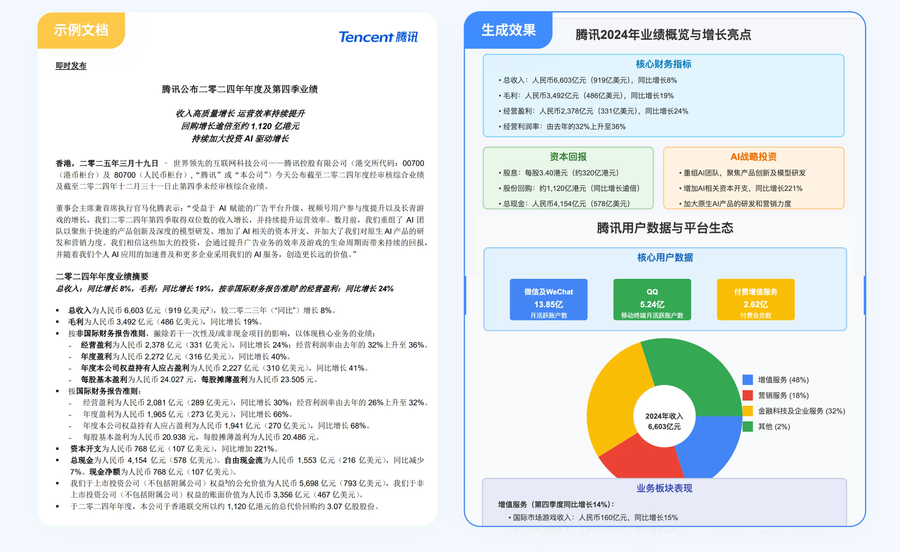
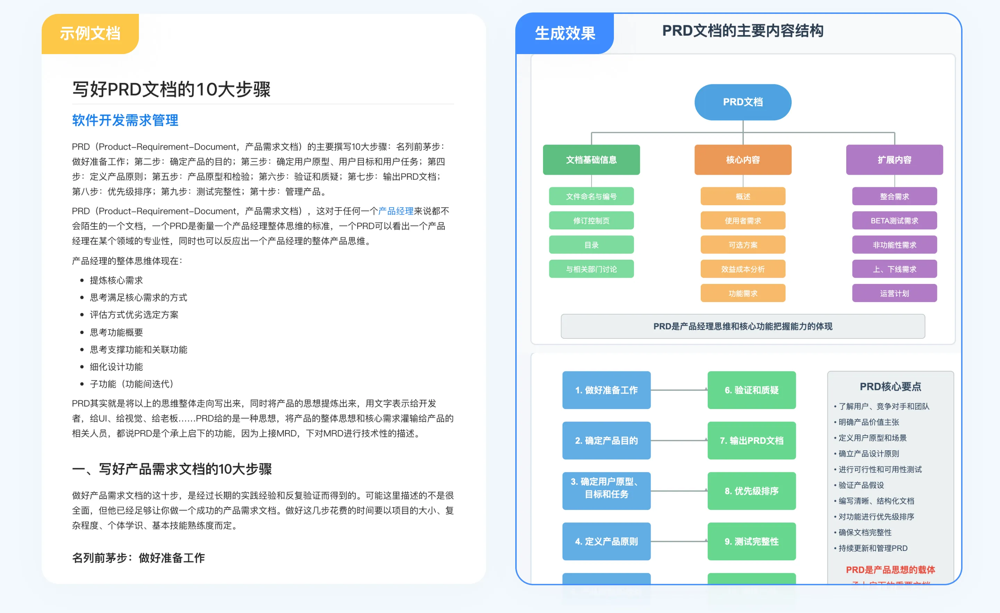
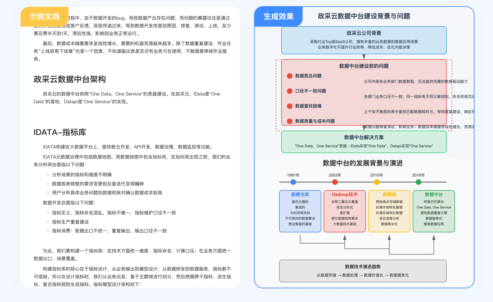
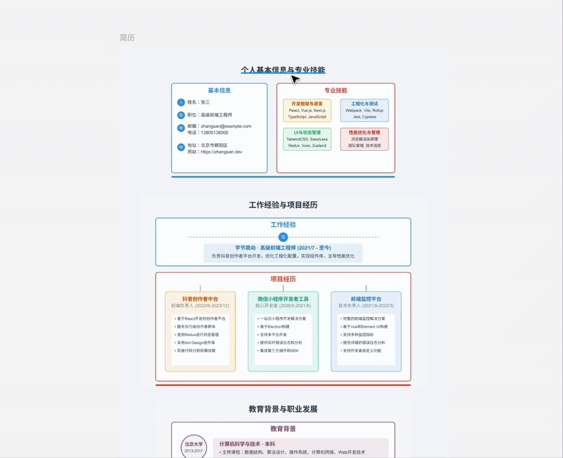

InfoVision 是一款文本信息图形化的工具，旨在帮助用户在信息密集环境中高效提取和整理关键信息。用户可上传 PDF 文件，系统将利用 AI 技术 自动解析内容，提炼核心要点及逻辑结构，并生成 可编辑的 SVG 文件，以便进一步处理和分析。
该工具适用于 学术论文阅读、项目计划梳理、长篇文献概览 以及 简历可视化 等多种场景，有助于提高信息筛选效率，增强内容理解与决策能力。

## 🌟 核心能力
🚀 可视化呈现 —— 一键生成 可编辑的 SVG 文件，打造 交互式知识图谱
📚 多场景适用 —— 无论是 学术论文、商业计划、长篇文献 还是 简历可视化，均可高效处理。
⚡ 提升阅读效率 —— 帮助用户快速筛选有效信息，减少信息过载带来的认知负担，提高决策效率。

## 🎯 产品用例：将学术论文拆解为可视化图片
<div align="center">

</div>

## 🎯 其他示例场景
 ✨ 企业财报解析
<div align="center">

</div>
<div align="center">
腾讯2024年度财报</div>

✨ 项目文档梳理
<div align="center">

</div>
<div align="center">
PRD文档撰写指南</div>

✨ 技术文档梳理
<div align="center">

</div>
<div align="center">
数据中台建设实践</div>


✨ 简历可视化：在线生成可视化简历SVG，支持编辑
<div align="center">

</div>
<div align="center">
一键创建可编辑简历</div>

✨ ✨ ✨ 欢迎解锁更多新用法！

当前产品版本为MVP第一版本，欢迎大家进行体验，解锁更多新用法，也欢迎提供宝贵的建议与我们一起共创。 
 🚀 🚀 🚀 访问 https://pdf2svg.aiyin.xyz/ 即刻体验 🚀 🚀 🚀 

## 安装说明

1. 克隆项目到本地

2. 安装依赖包：
```bash
pip install flask PyPDF2 pdfplumber requests
```

3. 创建必要的目录：
- uploads/：用于存储上传的PDF文件
- static/svg/：用于存储生成的SVG文件
- newtxt/：用于存储中间文本文件
- svgtxt/：用于存储处理后的文本

## 使用方法

1. 启动服务器：
```bash
python app.py
```

2. 访问Web界面：
- 打开浏览器访问 `http://127.0.0.1:8000`
- 选择PDF文件并上传
- 等待转换完成后即可在线预览SVG

## API接口

### 流式数据处理
- 端点：`/streamupload`
- 方法：POST
- 参数：file（PDF文件）
- 返回：SSE流式数据

## 注意事项

- 支持的最大文件大小为16MB
- 仅支持PDF格式文件上传
